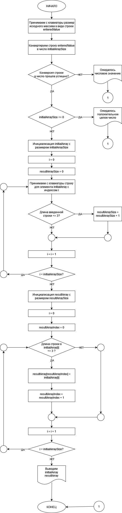

# Финальная работа

## Условие задачи

Написать программу, которая из имеющегося массива строк формирует
новый массив из строк, длина которых меньше, либо равна 3 символам.
Первоначальный массив можно ввести с клавиатуры, либо задать на старте
выполнения алгоритма. При решении не рекомендуется пользоваться коллекциями,
лучше обойтись исключительно массивами.

Примеры:

```
[“Hello”, “2”, “world”, “:-)”] → [“2”, “:-)”]
```

```
[“1234”, “1567”, “-2”, “computer science”] → [“-2”]
```

```
[“Russia”, “Denmark”, “Kazan”] → []
```

### Краткое описание алгоритма задачи

1. Создаем запрос у пользователя размера массива.
2. Проводим проверку, что введено числовое значение и что размер массива > 0.
3. Инициализируем пустой строковый массив с указанным размером.
4. Заполняем массив в цикле. Считаем количество строковых элементов, удовлетворяющих условию задачи (т.е количество элементов итогового массива).
5. Инициализируем итоговый массив.
6. Цикл по начальному массиву с проверкой длины каждого элемента. Заполняем итоговый массив.
7. Выводим начальный и итоговый массивы на экран.

### Блок-схема алгоритма

Блок-схема нарисована в онлайн-инструменте: [app.diagrams.net](https://app.diagrams.net/)

